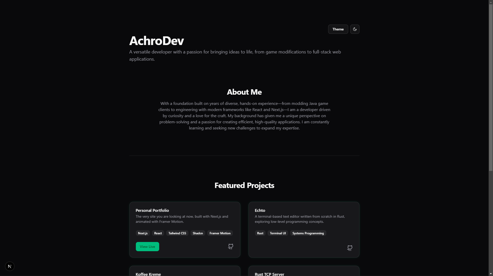

# AchroDev - Personal Developer Portfolio



This is the source code for my personal developer portfolio, live at [zbits.tech](https://zbits.tech). It's a fully responsive, multi-themed showcase of my projects and skills, built from the ground up with Next.js and styled with Tailwind CSS.

---

## Features

-   **Multi-Theme Support**: Includes several color themes (Default (Green), Slate, Rose, Violet) that can be switched on the fly.
-   **Light/Dark Mode**: A simple toggle to switch between light and dark modes, which works in tandem with the color themes.
-   **Dynamic Project Cards**: A grid of my featured projects with links to the live versions and GitHub repositories.
-   **Smooth Animations**: Subtle page and component animations powered by Framer Motion.
-   **Fully Responsive**: Designed to look and work great on all devices, from mobile phones to desktops.

## Tech Stack

-   **Framework**: [Next.js](https://nextjs.org/) (React)
-   **Styling**: [Tailwind CSS](https://tailwindcss.com/)
-   **UI Components**: [shadcn/ui](https://ui.shadcn.com/)
-   **Animations**: [Framer Motion](https://www.framer.com/motion/)
-   **Deployment**: [GitHub Pages](https://pages.github.com/) with GitHub Actions

## Running Locally

To run this project on your local machine, follow these steps:

1.  **Clone the repository:**
    ```bash
    git clone [https://github.com/AchroDev/achrodev.github.io.git](https://github.com/AchroDev/achrodev.github.io.git)
    ```

2.  **Navigate to the project directory:**
    ```bash
    cd achrodev.github.io
    ```

3.  **Install dependencies:**
    ```bash
    npm install
    ```

4.  **Run the development server:**
    ```bash
    npm run dev
    ```

Open [http://localhost:3000](http://localhost:3000) in your browser to see the result.